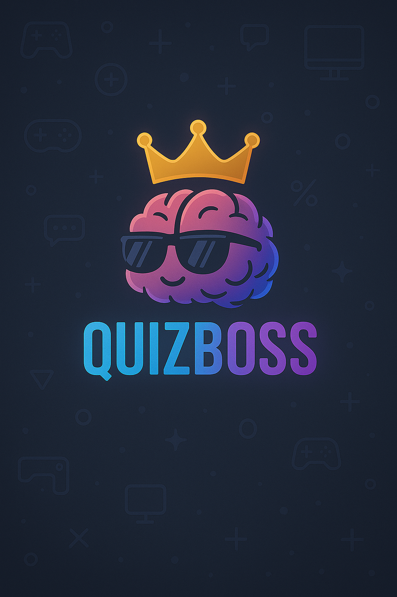

<p align="center">
  
</p>

---

## 🚀 Description

> QuizBoss is a web-based quiz platform with a videogame style that allows users to test their knowledge in a fun way.

---

## 🛠 Technologies Used

<p align="center">
  
  
  
  
  
</p>

---

## 🎮 Usage
- Register or login to start playing.

- Choose your favorite game mode.

- Answer questions and level up.

- Compete and improve your ranking!

---

## 🤝 Contributions
Contributions are welcome! Feel free to open an issue or pull request to improve the project.

Special thanks to contributors:

- @davirf5

- @Eliasmalx

- @erika-renau

---

##🙏 Acknowledgements
This project was developed as part of the bootcamp at 4Geeks Academy, whose mentorship and resources were fundamental for its completion.

---
## 💻 Installation

```bash
git clone https://github.com/nelcygarcia/Proyecto_Final_4Geeks_QuizBoss.git
pip install -r requirements.txt
# Follow backend and frontend instructions
